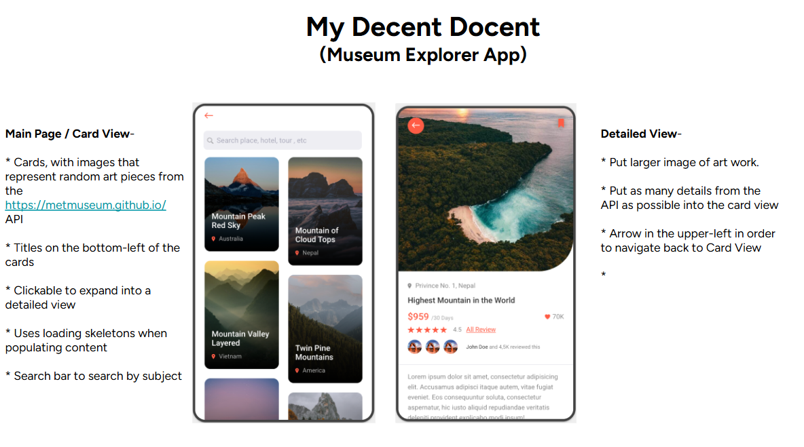

# Museum Art Gallery Web Application

A modern, responsive web application that showcases artwork from The Metropolitan Museum of Art Collection using their public API. This project demonstrates fundamental and advanced web development concepts while providing an engaging way to explore world-class art.



## 🎯 Project Overview

This educational web application allows users to:
- Browse and search through thousands of artworks from the Met's collection
- View detailed information about individual pieces including artist biography, cultural context, and technical details
- Discover related artworks through intelligent recommendations
- Experience responsive design that works on desktop, tablet, and mobile devices
- Learn about API integration, error handling, and modern JavaScript practices

## 🚀 Features

### Gallery View (`index.html`)
- **Search Functionality**: Search by artwork title, artist name, medium, or cultural keywords
- **Filter Options**: Filter by department, time period, and geographic region
- **Responsive Grid**: Adaptive layout that adjusts to different screen sizes
- **Infinite Scroll**: Load more artworks as you scroll (with rate limiting awareness)
- **Loading States**: Visual feedback during API calls
- **Error Handling**: Graceful degradation when API calls fail

### Detailed Artwork View (`artwork-detail.html`)
- **Comprehensive Metadata**: Artist information, dimensions, materials, cultural context
- **Image Gallery**: Primary image with additional views when available
- **Related Artworks**: Intelligent recommendations based on department and style
- **External Links**: Direct links to Met website and Wikidata entries
- **Tag System**: Clickable tags that link back to search results
- **Navigation**: Easy return to gallery view

### Technical Features
- **API Rate Limiting Detection**: Monitors and handles API rate limits gracefully
- **Retry Logic**: Automatic retry with exponential backoff for failed requests
- **Error Recovery**: User-friendly error messages with actionable guidance
- **Performance Optimization**: Efficient API calls with request batching
- **Debug Tools**: Built-in functions to monitor API usage and performance

## 🛠 Technology Stack

- **HTML5**: Semantic markup with modern accessibility features
- **CSS3**: Flexbox, Grid, custom properties, animations, and responsive design
- **JavaScript ES6+**: Async/await, modules, destructuring, arrow functions
- **Fetch API**: Modern HTTP requests with error handling
- **DOM Manipulation**: Dynamic content creation and event handling
- **Local Storage**: Persistent user preferences (future enhancement)

## 📚 Skills and Concepts Demonstrated

### Beginner Level (HTML/CSS Fundamentals)
- **Semantic HTML**: Proper use of header, main, section, article elements
- **CSS Selectors**: Class, ID, attribute, and pseudo-class selectors
- **Box Model**: Margin, padding, border, and content areas
- **Typography**: Font families, sizes, weights, and text styling
- **Color Theory**: Color schemes, contrast, and accessibility
- **Layout Basics**: Block vs inline elements, positioning

### Intermediate Level (Responsive Design & JavaScript)
- **Flexbox Layout**: Flexible container and item properties
- **CSS Grid**: Two-dimensional layout system
- **Media Queries**: Responsive breakpoints and mobile-first design
- **CSS Variables**: Custom properties for maintainable stylesheets
- **JavaScript Fundamentals**: Variables, functions, conditionals, loops
- **DOM Manipulation**: Selecting elements, changing content, handling events
- **Event Handling**: Click, scroll, and form submission events
- **Array Methods**: forEach, map, filter, find for data processing

### Advanced Level (API Integration & Modern JavaScript)
- **Async Programming**: Promises, async/await, error handling
- **Fetch API**: HTTP requests, response handling, status codes
- **Error Handling**: Try/catch blocks, graceful degradation
- **API Design Patterns**: RESTful endpoints, query parameters
- **Rate Limiting**: Detection, retry logic, exponential backoff
- **Performance Optimization**: Debouncing, request batching, caching
- **Modern JavaScript**: Arrow functions, destructuring, template literals
- **Module Pattern**: Code organization and encapsulation

### Professional Development Practices
- **Code Organization**: Separation of concerns, modular architecture
- **Error Logging**: Console debugging and status monitoring
- **User Experience**: Loading states, error messages, responsive feedback
- **Accessibility**: Semantic HTML, keyboard navigation, screen reader support
- **Documentation**: Code comments, README files, API documentation
- **Version Control**: Git workflow and project structure

## 🏗 Development Process

### Phase 1: Planning and Design
1. **Requirements Analysis**: Identified core features and user needs
2. **API Research**: Studied Met Museum API documentation and limitations
3. **UI/UX Design**: Created mockups and wireframes for responsive layout
4. **Technical Architecture**: Planned file structure and data flow

### Phase 2: Core Implementation
1. **HTML Structure**: Built semantic markup for both gallery and detail views
2. **CSS Foundation**: Implemented responsive grid system and base styles
3. **JavaScript Framework**: Created modular functions for API interaction
4. **Basic Functionality**: Search, display, and navigation features

### Phase 3: Enhancement and Polish
1. **Advanced Features**: Related artworks, filtering, and detailed metadata
2. **Error Handling**: Comprehensive error states and user feedback
3. **Performance Optimization**: Rate limiting detection and retry logic
4. **Responsive Design**: Mobile-first approach with progressive enhancement

### Phase 4: Testing and Documentation
1. **Cross-browser Testing**: Ensured compatibility across modern browsers
2. **Performance Testing**: Monitored API usage and response times
3. **User Testing**: Gathered feedback on usability and functionality
4. **Documentation**: Created comprehensive README and code comments

## 🎓 Educational Objectives

### Primary Learning Goals
- **API Integration**: Understanding how to work with external data sources
- **Asynchronous JavaScript**: Mastering promises and async/await patterns
- **Responsive Design**: Creating layouts that work across all devices
- **Error Handling**: Building robust applications that handle failures gracefully
- **User Experience**: Designing intuitive interfaces with proper feedback

### Secondary Learning Goals
- **Code Organization**: Structuring projects for maintainability and scalability
- **Performance Awareness**: Understanding the impact of API calls and optimization
- **Accessibility**: Building inclusive web applications
- **Documentation**: Writing clear, helpful documentation for other developers
- **Problem Solving**: Debugging and troubleshooting real-world issues

## ⚠️ Potential Student Challenges

### Technical Challenges

#### 1. **Asynchronous JavaScript Concepts**
- **Challenge**: Understanding the difference between synchronous and asynchronous code
- **Common Issues**: 
  - Using `await` without `async`
  - Not handling promise rejections
  - Confusion about execution order
- **Teaching Approach**: Start with simple examples, use visual diagrams, practice with console logging

#### 2. **API Integration Complexity**
- **Challenge**: Working with real-world APIs that have limitations and quirks
- **Common Issues**:
  - Not understanding HTTP status codes
  - Forgetting to handle network errors
  - Confusion about JSON parsing
- **Teaching Approach**: Begin with mock data, gradually introduce API concepts, emphasize error handling

#### 3. **CSS Layout Systems**
- **Challenge**: Understanding when to use Flexbox vs Grid vs traditional positioning
- **Common Issues**:
  - Flexbox direction and alignment confusion
  - Grid template areas and sizing
  - Responsive breakpoint logic
- **Teaching Approach**: Hands-on exercises with visual tools, incremental complexity

#### 4. **DOM Manipulation Patterns**
- **Challenge**: Efficiently updating the DOM without performance issues
- **Common Issues**:
  - Creating elements in loops inefficiently
  - Not caching DOM queries
  - Event listener memory leaks
- **Teaching Approach**: Show performance implications, teach best practices early

### Conceptual Challenges

#### 1. **Project Structure and Organization**
- **Challenge**: Understanding how files relate to each other
- **Common Issues**:
  - Mixing HTML, CSS, and JavaScript inappropriately
  - Not understanding the cascade in CSS
  - Global variable conflicts
- **Teaching Approach**: Emphasize separation of concerns, use clear naming conventions

#### 2. **Debugging and Problem Solving**
- **Challenge**: Systematic approach to finding and fixing bugs
- **Common Issues**:
  - Not using browser developer tools effectively
  - Changing multiple things at once
  - Not reading error messages carefully
- **Teaching Approach**: Teach debugging methodology, encourage incremental changes

#### 3. **User Experience Thinking**
- **Challenge**: Considering the user's perspective and needs
- **Common Issues**:
  - Not providing loading feedback
  - Unclear error messages
  - Ignoring accessibility concerns
- **Teaching Approach**: User testing exercises, accessibility audits, empathy building

## 🔧 Modifications for Different Ability Levels

### For Beginning Students

#### Simplified Version Features:
```javascript
// Simplified API call without error handling
async function getArtwork(id) {
    const response = await fetch(`${API_URL}/objects/${id}`);
    const data = await response.json();
    return data;
}

// Basic DOM manipulation
function displayArtwork(artwork) {
    document.getElementById('title').textContent = artwork.title;
    document.getElementById('artist').textContent = artwork.artistDisplayName;
}
```

#### Scaffolding Approaches:
1. **Pre-built HTML Structure**: Provide complete HTML with IDs for JavaScript targeting
2. **CSS Templates**: Give base styles that students can modify and extend
3. **Function Stubs**: Provide function signatures with TODO comments
4. **Step-by-Step Guides**: Break complex tasks into smaller, manageable steps
5. **Mock Data**: Use static JSON files before introducing live APIs

#### Reduced Complexity:
- Remove rate limiting detection
- Simplify error handling to basic try/catch
- Use simpler CSS layouts (flexbox only)
- Limit to single-page application
- Provide pre-written utility functions

### For Intermediate Students

#### Enhanced Challenges:
```javascript
// Add local storage for favorites
function toggleFavorite(artworkId) {
    const favorites = JSON.parse(localStorage.getItem('favorites') || '[]');
    const index = favorites.indexOf(artworkId);
    
    if (index === -1) {
        favorites.push(artworkId);
    } else {
        favorites.splice(index, 1);
    }
    
    localStorage.setItem('favorites', JSON.stringify(favorites));
    updateFavoriteButton(artworkId, index === -1);
}

// Implement search history
function addToSearchHistory(query) {
    const history = JSON.parse(localStorage.getItem('searchHistory') || '[]');
    history.unshift(query);
    const uniqueHistory = [...new Set(history)].slice(0, 10);
    localStorage.setItem('searchHistory', JSON.stringify(uniqueHistory));
}
```

#### Additional Features:
1. **Local Storage Integration**: Favorites, search history, user preferences
2. **Advanced Filtering**: Multiple filter combinations, date ranges
3. **Keyboard Navigation**: Arrow keys for gallery navigation
4. **Image Optimization**: Lazy loading, responsive images
5. **Analytics**: Track user interactions and popular searches

### For Advanced Students

#### Professional-Level Enhancements:
```javascript
// Implement caching strategy
class APICache {
    constructor(maxAge = 300000) { // 5 minutes
        this.cache = new Map();
        this.maxAge = maxAge;
    }
    
    set(key, value) {
        this.cache.set(key, {
            data: value,
            timestamp: Date.now()
        });
    }
    
    get(key) {
        const item = this.cache.get(key);
        if (!item) return null;
        
        if (Date.now() - item.timestamp > this.maxAge) {
            this.cache.delete(key);
            return null;
        }
        
        return item.data;
    }
}

// Service Worker for offline functionality
if ('serviceWorker' in navigator) {
    navigator.serviceWorker.register('/sw.js');
}
```

#### Advanced Challenges:
1. **Performance Optimization**: Implement caching, lazy loading, code splitting
2. **Offline Functionality**: Service workers, IndexedDB, offline-first approach
3. **Testing Framework**: Unit tests, integration tests, end-to-end testing
4. **Build Process**: Webpack, Babel, minification, optimization
5. **Accessibility Audit**: Screen reader testing, ARIA labels, keyboard navigation
6. **Progressive Web App**: Manifest file, installability, push notifications

### Universal Modifications for Accessibility

#### Visual Accessibility:
- High contrast mode toggle
- Font size adjustment controls
- Alternative text for all images
- Color-blind friendly color schemes

#### Motor Accessibility:
- Keyboard-only navigation
- Large click targets (minimum 44px)
- Reduced motion preferences
- Voice control compatibility

#### Cognitive Accessibility:
- Clear, simple language in error messages
- Consistent navigation patterns
- Breadcrumb navigation
- Help tooltips and explanations

## 🚀 Getting Started

1. **Clone or Download**: Get the project files to your local machine
2. **Open in Browser**: Open `index.html` in a modern web browser
3. **Explore the Code**: Start with `index.html`, then `styles.css`, then `script.js`
4. **Try the Features**: Search for artworks, click for details, test responsive design
5. **Open Developer Tools**: Monitor API calls and debug functionality
6. **Experiment**: Modify styles, add features, break things and fix them

## 📖 Additional Resources

- [Metropolitan Museum API Documentation](https://metmuseum.github.io/)
- [MDN Web Docs - JavaScript](https://developer.mozilla.org/en-US/docs/Web/JavaScript)
- [CSS Grid Guide](https://css-tricks.com/snippets/css/complete-guide-grid/)
- [Fetch API Tutorial](https://developer.mozilla.org/en-US/docs/Web/API/Fetch_API/Using_Fetch)
- [Responsive Design Principles](https://web.dev/responsive-web-design-basics/)

## 🤝 Contributing

This is an educational project designed for learning. Students and educators are encouraged to:
- Fork the project and add new features
- Create variations for different skill levels
- Submit improvements and bug fixes
- Share teaching experiences and modifications

## 📄 License

This project is created for educational purposes. The Metropolitan Museum of Art's API and images are subject to their terms of use. Please respect copyright and attribution requirements when using museum content.

---

*Built with ❤️ for education and the love of art*
